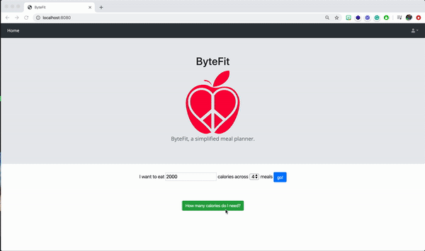

<p align="center">

</p>

# Bytefit

This application allows a user to generate calorie intake recommendations which are then supplemented by generated meal plans.

## Demonstration 



### Prerequisites

* Local MySQL DB instance - [Setup guide](https://dev.mysql.com/doc/mysql-getting-started/en/) 
* Java IDE: [IntelliJ](https://dev.mysql.com/doc/mysql-getting-started/en/) 
* Java Development Kit: [JDK11](https://www.oracle.com/java/technologies/javase-jdk11-downloads.html)
* Spoonacular API Key: [Guide](https://spoonacular.com/food-api/docs#Authentication)

## Getting Started

```
1. Navigate to "meals.js" within the project and populate the "apiKey" variable with your API key from Spoonacular. 
2. Navigate to the application properties and populate the variable "spring.datasource.password" with your MySQL instance password.
```

Proceed to run the application **MealPlannerApplication** class and navigate to your localhost on the port in the console output.

## Running the tests

There are automated unit tests which will be executed upon application startup. 
The tests in place verify that the UserService class which rely upon the repositories are working as expected.
This is vital to ensuring that User accounts can be created, and thus also providing re-assurance that database is up and running.

## Built With

* [Spoonacular API](https://spoonacular.com/food-api) - Food API

## Acknowledgments

* [Spring Boot + Spring MVC + Spring Security + MySQL guide](https://medium.com/@gustavo.ponce.ch/spring-boot-spring-mvc-spring-security-mysql-a5d8545d837d)
